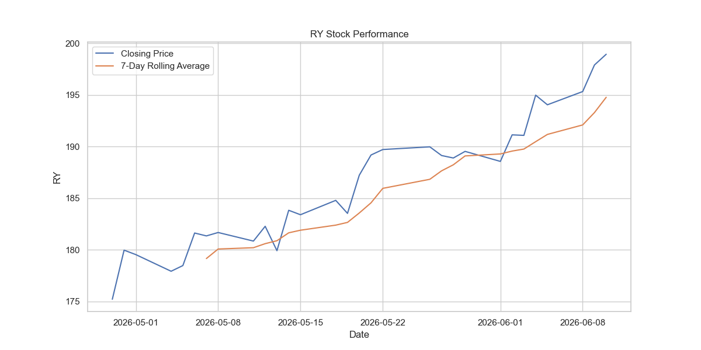
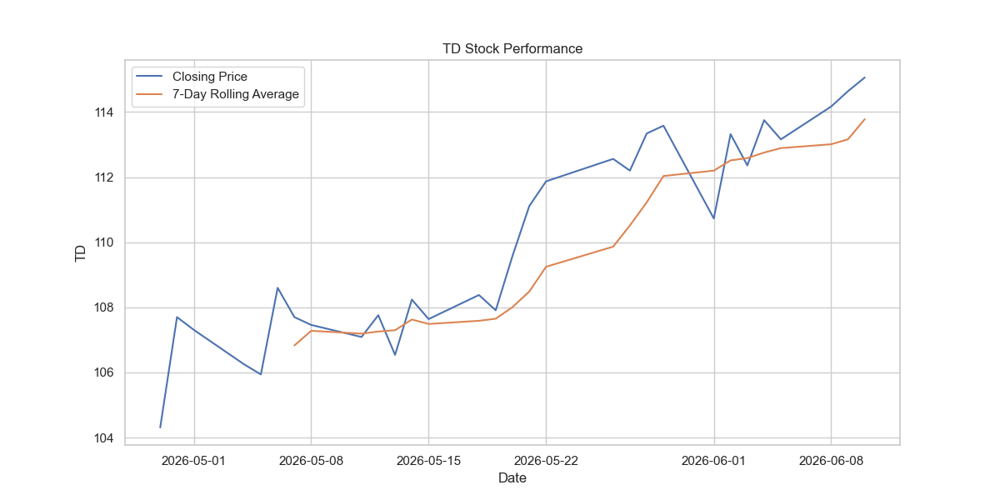
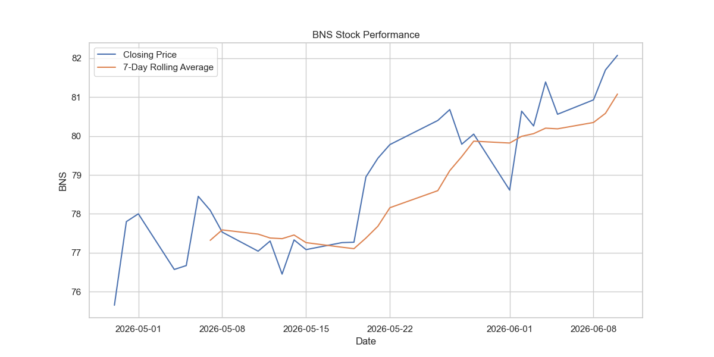
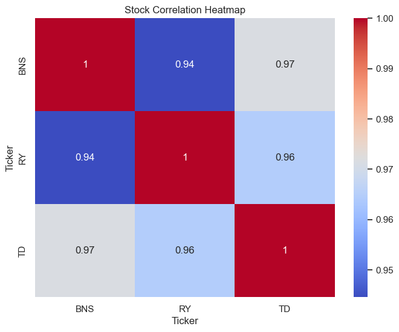
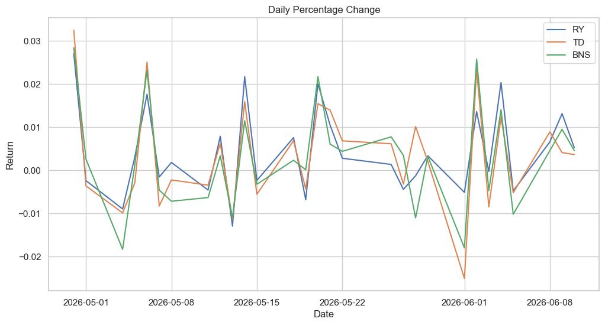
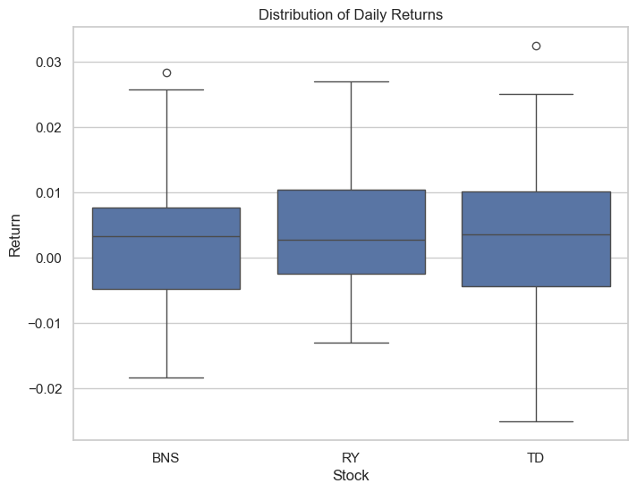
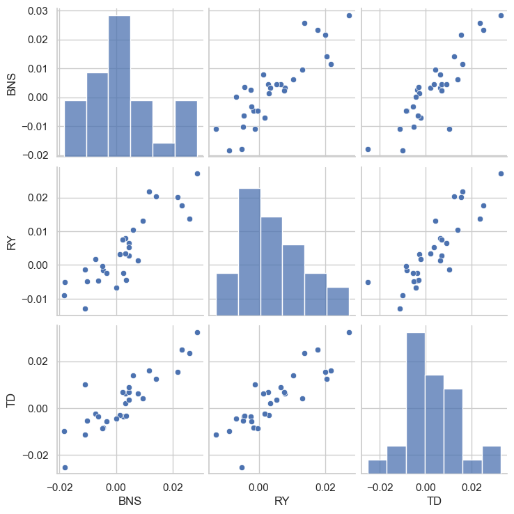

# 📈 Stock Market Data Pipeline and Analysis Using Python

## Overview

This project analyzes the last 30 days of stock market data for three major Canadian banks:

- Royal Bank of Canada (RY)
- Toronto-Dominion Bank (TD)
- Bank of Nova Scotia (BNS)

Using Python and financial data from Yahoo Finance, the project performs data collection, preprocessing, statistical analysis, and visualization to identify market trends and stock performance.

---

## Objectives

- Download stock market data using Yahoo Finance API.
- Analyze historical stock prices.
- Calculate 7-Day Rolling Averages.
- Calculate Daily Percentage Changes.
- Detect significant price drops greater than 2%.
- Visualize stock performance using professional charts.
- Generate a report for further analysis.

---

## Technologies Used

- Python
- Pandas
- NumPy
- Matplotlib
- Seaborn
- yfinance
- Jupyter Notebook

---

## Project Workflow

### 1. Data Collection

Stock data is downloaded directly from Yahoo Finance using the yfinance library.

Stocks analyzed:

- RY
- TD
- BNS

---

### 2. Data Preparation

The project extracts adjusted closing prices and checks for missing values before performing analysis.

---

### 3. Rolling Average Analysis

A 7-Day Rolling Average is calculated to smooth short-term fluctuations and identify underlying trends.

Formula:

Rolling Average = Average of Previous 7 Trading Days

---

### 4. Daily Return Analysis

Daily percentage returns are calculated to measure day-to-day stock performance.

Formula:
$$
\text{Daily Return} = \frac{\text{Current Price} - \text{Previous Price}}{\text{Previous Price}}
$$

---

### 5. Risk Detection

The project flags trading days where the stock price decreases by more than 2%.

Condition:

Daily Return < -2%

---

## Visualizations

## Closing Price vs 7-Day Rolling Average

The line charts compare the daily closing prices of BNS, RY, and TD stocks with their respective 7-day rolling averages. The rolling average smooths short-term fluctuations and helps identify the underlying trend in stock performance.

All three stocks exhibited a generally upward trend throughout the analysis period. While daily closing prices showed some fluctuations, the 7-day rolling averages increased steadily, indicating consistent growth over time. Among the three stocks, RY experienced the largest increase in price, while BNS and TD also demonstrated strong positive performance.

The close alignment between the closing price and rolling average lines suggests stable price movements with limited volatility. Temporary deviations from the rolling average reflect short-term market reactions, but the overall trend remained positive for all three stocks.

**Key Insight:** The upward-sloping 7-day rolling averages confirm a bullish trend across all three banking stocks, indicating sustained growth and positive investor sentiment during the observed period.





---
## Daily Return Distribution

The histograms illustrate the distribution of daily returns for **BNS**, **RY**, and **TD** stocks. Most daily returns are concentrated around zero, indicating that large price changes were relatively uncommon during the analysis period. The bell-shaped distributions suggest that daily returns generally followed a normal pattern, with a mix of positive and negative returns.

Among the three stocks, **TD** exhibited a slightly wider spread of returns, indicating higher volatility. **RY** showed a more concentrated distribution around the mean, suggesting relatively stable daily performance. **BNS** displayed a balanced distribution with moderate variability and a few extreme return values.

The presence of both positive and negative returns reflects normal market fluctuations, while the concentration of observations near the center indicates that daily price movements were generally moderate.

**Key Insight:** All three banking stocks demonstrated relatively stable return distributions, with TD showing slightly higher volatility and RY exhibiting the most consistent daily return pattern.


---
## Correlation Analysis

The correlation heatmap shows the relationship between the stock prices of **BNS**, **RY**, and **TD**. Correlation values range from **-1 to +1**, where:

- **+1** indicates a perfect positive relationship (stocks move together).
- **0** indicates no relationship.
- **-1** indicates a perfect negative relationship (stocks move in opposite directions).

### Correlation Results

| Stock Pair | Correlation |
|------------|------------|
| BNS & RY | 0.94 |
| BNS & TD | 0.97 |
| RY & TD | 0.96 |

### Interpretation

The analysis reveals **strong positive correlations** among all three banking stocks. This means that when the price of one stock increases or decreases, the others tend to move in the same direction.

Since **BNS (Bank of Nova Scotia)**, **RY (Royal Bank of Canada)**, and **TD (Toronto-Dominion Bank)** operate within the same banking industry, they are often affected by similar factors such as:

- Interest rate changes
- Economic growth and recession trends
- Banking regulations
- Inflation and monetary policies
- Overall financial market conditions

### Key Insight

The very high correlation values (**0.94–0.97**) indicate that these stocks exhibit highly similar price movements over time. As a result, including all three stocks in a portfolio may provide **limited diversification benefits**, because they are likely to respond similarly to market events and economic changes.

> **Business Insight:** Investors seeking better portfolio diversification may consider adding stocks from different sectors (e.g., technology, healthcare, or consumer goods) rather than relying solely on highly correlated banking stocks.



---
## Daily Percentage Change Analysis

The line chart illustrates the daily percentage changes in stock prices for **BNS**, **RY**, and **TD** over the analysis period. Daily percentage change measures the rate at which a stock's price increases or decreases from one trading day to the next.

All three stocks experienced fluctuations between positive and negative returns, reflecting normal market movements. The patterns of the three lines are quite similar, indicating that the stocks often reacted similarly to market conditions. While most daily changes remained within a moderate range, a few sharp increases and decreases were observed, representing periods of higher market volatility.

Among the three stocks, **TD** and **BNS** showed slightly larger fluctuations on certain days, whereas **RY** exhibited relatively smoother movements. Despite these short-term variations, the overall return patterns remained closely aligned.

**Key Insight:** The similar movement patterns suggest a strong relationship among the three banking stocks, indicating that they are influenced by common industry and economic factors.



---

## Box Plot Analysis of Daily Returns

The box plot presents the distribution of daily returns for **BNS**, **RY**, and **TD** stocks. It highlights the median, spread of returns, and potential outliers for each stock.

The median returns of all three stocks are slightly positive and very similar, indicating comparable average daily performance. The size of the boxes suggests that the middle 50% of returns are distributed within a similar range for all stocks. However, **TD** shows a slightly wider spread, indicating higher volatility compared to BNS and RY.

A few outliers can be observed in **BNS** and **TD**, representing days with unusually high returns. These outliers may have been caused by significant market events or company-specific news.

**Key Insight:** All three banking stocks exhibit relatively stable return distributions with similar performance patterns. However, TD appears to be slightly more volatile, while RY demonstrates the most consistent daily returns among the three stocks.



---

## Pairwise Relationship Analysis

The pair plot visualizes the relationships between the daily returns of **BNS**, **RY**, and **TD** stocks. The diagonal charts show the distribution of returns for each stock, while the scatter plots illustrate the relationship between pairs of stocks.

The scatter plots reveal a clear positive relationship among all stock pairs, as most data points follow an upward trend. This indicates that when the return of one stock increases, the returns of the other stocks tend to increase as well. The distributions on the diagonal show that daily returns are concentrated around the mean, with relatively few extreme values.

The strongest relationships are observed between **BNS and TD** and between **RY and TD**, where the data points are closely clustered along a positive trend line. This suggests that the three banking stocks often move together due to common industry and economic influences.

**Key Insight:** The strong positive relationships among BNS, RY, and TD indicate that their returns are highly correlated, reflecting similar market behavior and limited diversification benefits when held together in a portfolio.


---

## Project Structure

```text
stock-market-data-pipeline-analysis/
│
├── stock_analysis.ipynb
├── README.md
├── requirements.txt
├── stock_report.csv
│
└── visualizations/
    ├── stock_performance/
    │   ├── BNS_performance.png
    │   ├── RY_performance.png
    │   └── TD_performance.png
    │
    ├── bns_daily_return_distribution.png
    ├── boxplot.png
    ├── correlation_heatmap.png
    ├── daily_percentage_change.png
    ├── pair_charts.png
    ├── ry_daily_return_distribution.png
    └── td_daily_return_distribution.png
  
 ```

---

## Installation

Clone the repository:

```bash
git clone https://github.com/yourusername/stock-market-data-pipeline-analysis.git
```

Install required packages:

```bash
pip install -r requirements.txt
```

---

## Required Libraries

```bash
pip install pandas
pip install yfinance
pip install matplotlib
pip install seaborn
```

---

## Running the Project

Open the notebook:

```bash
jupyter notebook
```

Run:

```text
stock_analysis.ipynb
```

---

## Sample Output

The project generates:

- Stock Performance Charts
- Rolling Average Analysis
- Daily Return Analysis
- Correlation Matrix
- Risk Detection Flags
- CSV Report
---

## Key Insights

- All three Canadian bank stocks (**RY, TD, and BNS**) exhibited an overall upward trend during the 30-day analysis period, supported by both closing prices and 7-day rolling averages.

- The 7-day rolling averages helped smooth short-term fluctuations and highlighted a consistent positive trend across all stocks.

- Correlation analysis revealed strong positive relationships among the stocks:
  - **BNS and TD:** 0.97
  - **RY and TD:** 0.96
  - **BNS and RY:** 0.94

- The high correlation values indicate that the stocks tend to move together and are influenced by similar economic and industry factors.

- Daily return distributions were centered around zero, suggesting relatively stable day-to-day price movements.

- Box plot analysis showed similar return distributions and comparable levels of short-term volatility across the three stocks.

- **TD** was the most volatile stock, recording the highest positive daily return (approximately **3.2%**) and the largest negative daily return (approximately **-2.5%**).

- The risk detection analysis identified one significant downside movement in TD, while RY and BNS showed no major risk signals during the observed period.

- Pairwise relationship analysis further confirmed the strong positive association among stock returns, supporting the correlation heatmap results.

- Overall, the three banking stocks demonstrated **strong co-movement, moderate volatility, and positive short-term performance**, reflecting the stability of the Canadian banking sector during the analysis period.
---

## Author

**Mohammad Umar Fareed**


